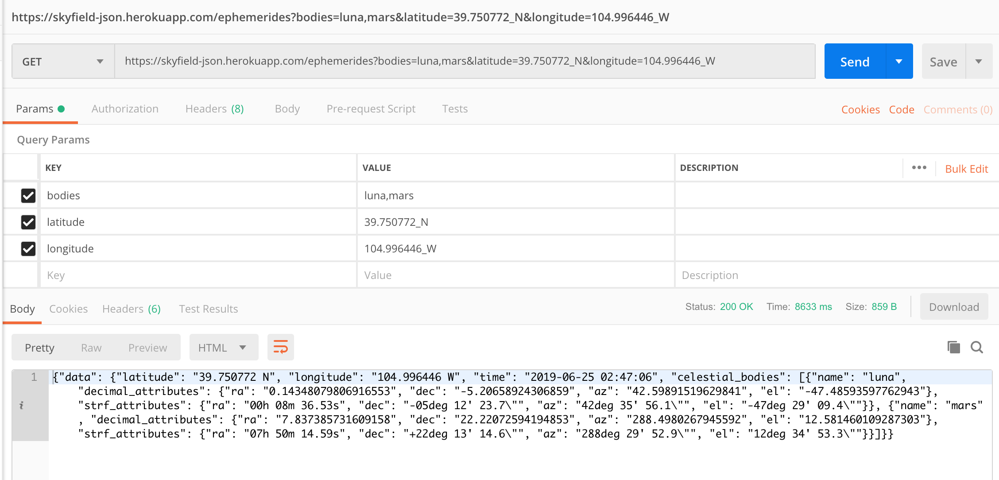

# Skyfield JSON

What do you do when the API that you planned your entire school project around is no longer in service? You build your own open source Microservice to provide the API endpoints that you need. Using an impressive dataset provided by **Jet Propulsion Laboratory**, combined with a [Skyfield - Python package](https://pypi.org/project/skyfield/) that performs the orbital mechanic calculations required to find the apparent locations of celestial bodies  - we were able to build out a stand alone Python application which delivers the information that we consume by our **Space In Your Face** Rails application.

[https://github.com/Matt-Weiss/spaceinyourface](https://github.com/Matt-Weiss/spaceinyourface)
[https://spaceinyourface.herokuapp.com](https://spaceinyourface.herokuapp.com)

Endpoint for Celestial Bodies:\
`https://skyfield-json.herokuapp.com/ephemerides?`

For what celestial bodies are available reference
[https://rhodesmill.org/skyfield/](https://rhodesmill.org/skyfield/)

Params:\
`longitude` - string with underscore and direction - Ex: `41_W`\
`latitude` - string with underscore and direction - Ex: `41_N`\
`bodies` - comma seperated string of celestial bodies - Ex: `mercury,venus,mars,jupiter`\
*at this time no key is needed for this request*

A successful request will have a URL which looks like this: \
`https://skyfield-json.herokuapp.com/ephemerides?longitude=41_W&latitude=41_N&bodies=mercury,venus,mars,jupiter`

#### Example JSON Output:



```json
{
	"data": {
		"latitude": "41.345 N",
		"longitude": "41.112 W",
		"time": "2019-05-27 15:52:18",
		"celestial_bodies": [{
				"name": "mercury",
				"decimal_attributes": {
					"ra": "4.778648664415373",
					"dec": "23.67915462647844",
					"az": "208.18889336319882",
					"el": "70.52100842964909"
				},
				"strf_attributes": {
					"ra": "04h 46m 43.14s",
					"dec": "+23deg 40' 45.0",
					"az": "208deg 11' 20.0",
					"el": "70deg 31' 15.6"
				}
			},
			{
				"name": "venus",
				"decimal_attributes": {
					"ra": "2.8393006859993086",
					"dec": "14.896838769797116",
					"az": "243.60921355444862",
					"el": "47.23444778722323"
				},
				"strf_attributes": {
					"ra": "02h 50m 21.48s",
					"dec": "+14deg 53' 48.6",
					"az": "243deg 36' 33.2",
					"el": "47deg 14' 04.0"
				}
			}
		]
	}
}
```
